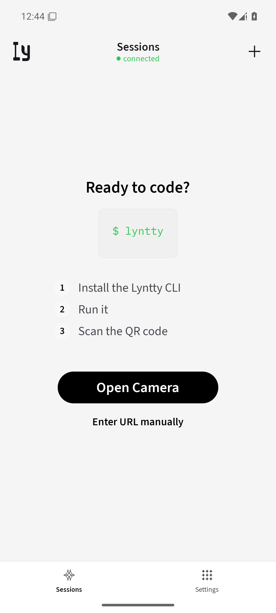
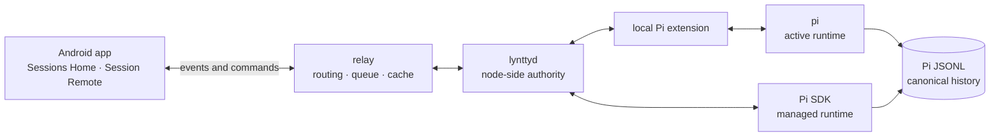

<div align="center">
  
  <h1>Lyntty</h1>
  <p><em>Control the <code>pi</code> sessions on your own computer from Android.</em></p>
</div>

<p align="center">
  <a href="https://github.com/jczhang02/lyntty/stargazers"></a>
  <a href="https://github.com/jczhang02/lyntty/releases"></a>
  <a href="https://github.com/jczhang02/lyntty/actions/workflows/typecheck.yml"></a>
  <a href="https://jczhang02.github.io/lyntty/"></a>
  <a href="./LICENSE"></a>
</p>

<p align="center">
  <a href="https://jczhang02.github.io/lyntty/">Documentation</a> ·
  <a href="https://github.com/jczhang02/lyntty/releases/latest">Stable release</a> ·
  <a href="./docs/architecture/pi-shared-control.md">Architecture</a> ·
  <a href="./docs/development.md">Development</a> ·
  <a href="./docs/faq.md">FAQ</a>
</p>

Lyntty is an Android-first, self-hosted control surface for local `pi` sessions. You can leave the computer without leaving the real session: send another request, follow live work, inspect results, redirect the run, or stop it from your phone. The workspace, tools, credentials, MCP servers, and canonical Pi history remain on the paired node.

> [!IMPORTANT]
> Lyntty is currently an owner-operated, self-hosted project. There is no public `relay` service, Play Store listing, or unverified `curl | sh` bootstrap. Read the exact Stable Release notes and use App, CLI/`lynttyd`, `relay`, and Wire artifacts selected by the same signed Compatibility BOM.

<p align="center">
  
</p>
<p align="center"><sub>Current-source visual reference from an isolated Android emulator and a local Preview-style build. It is not a Stable artifact and is not physical-device acceptance evidence.</sub></p>

## Features

- **Shared control, not a second runtime**: Phone input reaches the same computer-running `pi` session through the local Pi extension.
- **A mobile view of real work**: `Session Remote` presents messages, thinking, tool activity, results, errors, changed-file context, and checks without becoming a terminal mirror.
- **Active and historical sessions**: `Sessions Home` keeps running, waiting, recent, failed, and completed sessions easy to return to.
- **Explicit runtime ownership**: One session has one `active runtime`; takeover, redirect, interrupt, and stop behavior stays deliberate.
- **Continuity after reconnects**: Pi JSONL remains canonical, events are ordered and deduplicated, and Lyntty shows `history_gap` when continuity cannot be proven.
- **Self-hosted control path**: The `relay` routes events and commands while `lynttyd` keeps node-side discovery, control, recovery, and redaction local.

## Product surfaces

| Surface | What it is for |
| --- | --- |
| **Sessions Home** | Find active and historical `pi` sessions and return to the work that needs attention. |
| **Session Remote** | Send requests, follow progress, inspect tool activity and results, add follow-up context, redirect, or stop. |
| **Node Management** | Pair computers running `lynttyd`, inspect health and trust state, and manage supported node actions. |
| **Settings** | Configure the `relay`, owner/device binding, revocation, and recovery entry points. |

Lyntty is not a remote desktop, phone IDE, terminal mirror, task board, PR manager, or multi-user agent platform.

## How it works



The ordinary shared-control path is:

```text
phone -> relay -> lynttyd -> local Pi extension -> pi
```

Only `lynttyd` bridges node-side sessions to the `relay`. The Pi extension talks only to local `lynttyd`; it never connects to the public `relay`. The separate operator command `lyntty remote` may connect directly to the `relay`, but it is not the phone-to-Pi bridge.

## Quick Start

### Use a Stable release

A Lyntty installation is a matched, self-hosted system rather than one standalone APK:

1. Open the [current Stable Release](https://github.com/jczhang02/lyntty/releases/latest) and read its validation and platform-signing disclosures.
2. Deploy the exact `relay` image selected by its signed Compatibility BOM. The [`relay` VPS runbook](./docs/deploy/relay-vps.md) documents the reference topology and recovery boundaries.
3. Install the Android APK and the matching CLI/`lynttyd` archive from that same Release. Follow the [Android](./docs/release/android-apk.md) and [CLI](./docs/release/cli.md) runbooks instead of mixing independent “latest” assets.
4. Follow [Getting started](./docs/getting-started.md) to point the App at your `relay` and persist that same URL for the node, then run the [hash-pinned installer](./docs/release/cli.md). Approve its pairing request in the App. One first-install transaction authenticates and installs the CLI, `lynttyd` service, and local Pi extension.

After a successful first install, verify rather than repeating the repair commands:

```bash
lyntty daemon status
lyntty doctor
lyntty update status --json
lyntty
```

Authentication, service installation, and extension installation commands are reserved for the documented repair paths. After the extension changes, start a new Pi session or run `/reload` yourself. Lyntty never forces a reload of an active Pi session.

### Run locally

The repository uses Bun only. From an isolated Git worktree:

```bash
bun install --frozen-lockfile
bun dev:up
bun dev:verify
bun dev:down
```

`bun dev:up` starts a worktree-local `relay` and `lynttyd` with isolated credentials, databases, logs, state, and ports. It does not touch live `~/.pi` or `~/.lyntty` state.

Start the Android emulator path explicitly:

```bash
bun dev:up --android
```

For a standalone release-style Preview APK on a physical Android phone:

```bash
bun preview:test
```

See [Isolated local development](./docs/development.md) for ownership checks, state layout, logs, and cleanup behavior.

## Trust boundaries

- Real work and canonical Pi JSONL stay on the paired node.
- The Pi extension is local-only; `lynttyd` is the node-side session bridge.
- The `relay` stores encrypted sync state, metadata, queues, and caches, but it is not canonical history.
- Basic redaction happens before events leave the node. Lyntty does not claim a zero-trust or fully end-to-end encrypted design.
- Stable artifacts are bound by checksums, provenance, attestations, and a signed Compatibility BOM.
- Android verifies an APK before opening Package Installer; installation always requires user confirmation.

## Platform scope

| Component | Current scope |
| --- | --- |
| Android App | Primary product and release acceptance target. |
| CLI + `lynttyd` | Linux and macOS user services; Windows artifacts receive smoke coverage only. |
| `relay` | Self-hosted container with PGlite by default and explicit PostgreSQL support. |
| iOS | Best-effort Expo compatibility, not a release acceptance target. |
| Web / Tauri / Codium | Legacy or development context, not product surfaces. |

## Repository map

| Package | Responsibility |
| --- | --- |
| [`packages/lyntty-app`](./packages/lyntty-app) | Expo/React Native Android App, session UI, sync reducers, local storage, and Maestro selectors. |
| [`packages/lyntty-cli`](./packages/lyntty-cli) | `lyntty`, `lynttyd`, Pi runtime integration, local control, and extension installation. |
| [`packages/lyntty-relay`](./packages/lyntty-relay) | Self-hosted API, Socket.IO/RPC routing, authentication, encrypted sync, and storage. |
| [`packages/lyntty-wire`](./packages/lyntty-wire) | Shared session-protocol schemas, capabilities, and Compatibility BOM contracts. |

## Current documentation

- [Documentation site](https://jczhang02.github.io/lyntty/)
- [Getting started](./docs/getting-started.md) · [中文](./docs/getting-started.zh.md)
- [FAQ](./docs/faq.md) · [中文](./docs/faq.zh.md)
- [Troubleshooting](./docs/troubleshooting.md) · [中文](./docs/troubleshooting.zh.md)
- [Security policy](./SECURITY.md) · [中文](./SECURITY.zh.md)
- [Contributing](./CONTRIBUTING.md) · [中文](./CONTRIBUTING.zh.md)
- [Product context](./docs/contexts/product/CONTEXT.md) · [中文](./docs/contexts/product/CONTEXT.zh.md)
- [Pi shared-control architecture](./docs/architecture/pi-shared-control.md)
- [Development guide](./docs/development.md) · [中文](./docs/development.zh.md)
- [`relay` deployment](./docs/deploy/relay-vps.md) · [中文](./docs/deploy/relay-vps.zh.md)
- [Android release](./docs/release/android-apk.md) · [中文](./docs/release/android-apk.zh.md)
- [CLI release](./docs/release/cli.md) · [中文](./docs/release/cli.zh.md)
- [Compatibility and rollback policy](./docs/release/compatibility-bom.md) · [中文](./docs/release/compatibility-bom.zh.md)
- [CI quality gates](./docs/quality/ci.md) · [中文](./docs/quality/ci.zh.md)
- [Repository context map](./CONTEXT-MAP.md)

## Historical records

`docs/research/`, `docs/recovered/`, old roadmaps, and `docs/evidence/` preserve historical decisions and point-in-time proof. They do not override current contexts, accepted architecture, code, or tests.

## License

Lyntty is available under the [MIT License](./LICENSE), with upstream and third-party notices preserved in the repository.
